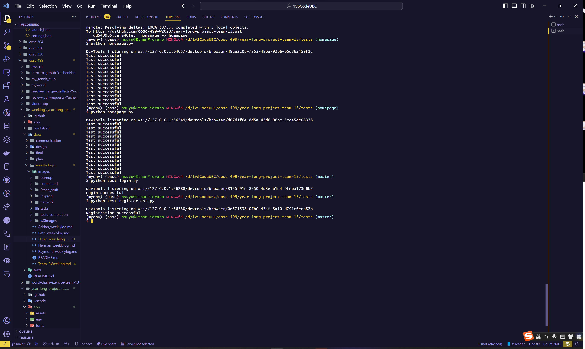
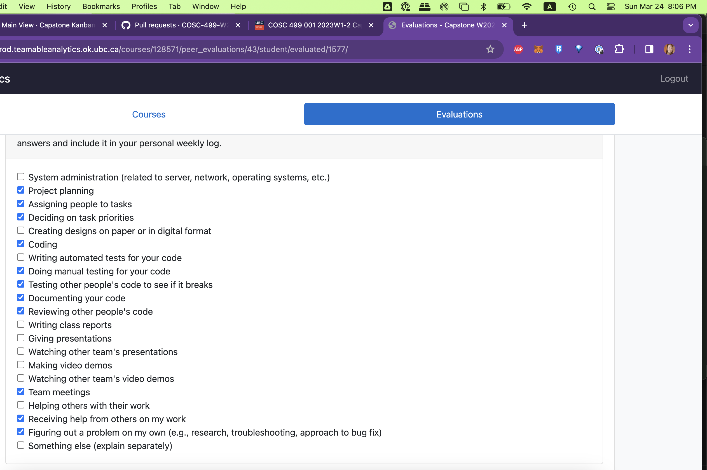

# Weekly Personal Log

### Week 4 Sept 25 - Oct 1

This week we all worked together to work on the Project plan.

### Week 5 Oct 2 - Oct 8

This week was spent learning Django and becoming familiar with Python. I followed along with some online tutorials. This was for the learning django basics and set up. The following images are from the completion of the online tutorials.

### Week 6 Oct 9 - Oct 15

The setup and testing of the "Setting up the project Django base" on my computer. I also started working on the home page. I tried connecting the newly found html and css files to the basic set up of Django. The Setting up the project Django base is complete. The Home page is still in progress. I also started reading through a W3 school AWS tutorial to begin to be comfortable with AWS.

### Week 7 Oct 16 - 22

Completed the homepage css bug and linked all of the homepage buttons to their respective pages (That are still in progress or just empty html pages). Followed several aws tutorials and completed the aws amplify github connection guide. AWS was able to successfully build and deploy.

### Week 8 Oct 23 - 29

My features for this week was homepage and testing. On the project board they are called homepage. Homepage is now tested and in the done section. I also worked on presentation prep which is still in progess.
Finally, I also worked on implementing a CI Pipeline which is still in progress.

Screen shot of presentation outline

Screen shot of most recent build with the pipline

Screen shot of all builds this week

Screen shot of homepage tests

### Week 9 Oct 30 - Nov 5

I focused on the preparation for the presentation. Finishing a last few things for the homepage and other functions. We also spent a while practicing the presentation. I also did a little bit of debugging for the CI-workflow in github actions. The remainder of my time this week was spent watching other teams present and giving them feedback.

### Week 10 Nov 6 - Nov 12

The features in the project plan I worked on this week were the AWS and CI-pipeline as well as the System architecture. The tasks associated are learning aws and setup, and system architecture. We have completed the UML diagram and basic mapping of the html linking. I have still not finished the pipeline yet, nor is the aws functional. This has been a huge learning curve and so much of my time this week has been reading internet sources to try and understand the problems I have been having.

A copy of the builds worked on this for the ci-pipeline and testing.

A copy of the best build that succeeded but is not finding the files

The html linking diagrams I worked on:

### Week 11/12 Nov 13 - Nov 25

My features in the project plan for this milestone were aws and database and the UI for the Create Video page. On the task board these are called Learning AWS and Setup, CSS dev, User Interface Design, Bug Fixing, Database, and Create Video. I have spend approximately 18 hours on the aws database setup with lots and lots of bug fixing this week(s). It is still inprogress and not yet completed. I also spent a fair amount of time on the Create Video UI. The UI is completed and the tests are written but not yet passing. I also spent some time testing and reviewing other Ethan's and Adrian's code.

##### Here are some of the progress I made with Aws and the different erros that have come up so far.

##### Current Output with AWS

##### Current Terminal Error

##### Create Video UI

##### Test Report for my stuff

### Week 13 Nov 27 - Dec 3

My features in the Project plan this week were the UI for Request Video and Create Video. As well as the Design Milestone document and video. On the board these were called Reqeust Video UI, Create Video UI and Design Milestone. I completed all three of these. I also wrote tests for both Request Video and Create Video (See team log for test report). I also spent some time reviewing and testing some of my team members code (See Closed Pull requests for reviews). As well, I spent a small amount of time fixing AWS. Finally, I also added a model to our current database to connect to the Request Video UI (See models.py and form.py for changes). It is connected but not fully functional yet. (All changes have been merged into master)

##### Request Video UI

# Term 2

### Week 1 Jan 8 - 14

My feature this week was to work on the CI testing pipeline. This is associated with the CI Automated Testing task on the project board. This is still in progress as I spent the first little bit of this week to try and resolve problems. I then decided to restart with a simplier testing file and I rewrote the yml file. As well, I made an entirely new workflow for github actions. Currently I seem to have a problem with pytest itself and loading in the requirements on my computer.

#### Quick snap shot of the most recent error

### Week 2 Jan 15 - 21

For this week, I focused on updating the Selenium tests to have clearer print messages and to eliminates the reacurring clickable bugs. As well as to create a proper test report file to pipe the master tests into. This is the testing structure task in the project board which is in the review phase from my other team members. I also worked on updating the top bar to include a drop down menu. The drop down menu works on all pages and I have not yet got a passing test for it. This is associated with the reorganize top bar task. Ethan was a big help with figuring out some weird topbar css bugs.

### Week 3 Jan 22 - Jan 28

For this week, I worked on the Record a video functionality and testing and updating the tests to include the hover feature in the topbar. These are associated with the Create Video Function task and reorganize topbar task in the project board. The topbar testing has been completed and merged into the master branch after team members reviewed it. I have been able to get the record a video functional but I have not been able to connect it to the HTML button on the website.

### Week 4 Jan 29 - Feb 4

For this week, we focused on the peer testing preparation and redefining task priorities after the peer testing. As well, I worked on adding in a permission feature to allow for the two user groups to access the respective pages. This is associated with the Update Permissions on Pages task. This is close to being completed and my next step is to update the tests that are associated with those certain pages. Ethan and I worked on this together as there were two pages so we each worked on one page and worked together to get the styling to be the same on each page.

### Week 5 Feb 5 - 11

This week my features were the Record a video as well as finishing up the testing for the permissions for users. These are associated with the Create Video function and Update Permissions on Pages tasks on the project board. I was able to sucessfully complete all of the testing for the permissions and once that was reviewed it was merged in. I tried several ways to connect the record python function to the html button. None were sucessful. I tried running the python file using a onclick javascript function. I tried linking the python file in pyscript as well as running the python code in pyscript. I then tried connecting the python file through views and urls in django. Finally, I tried remaking the file in javascript and connecting it from there. That was what I had the most sucess with as I was able to at least get a video to appear on the screen but it does not record and save the video. I am hoping I will have more sucess next week. I may also ask peers to see how they approached this.

### Week 6 Feb 12 - 18

This week my features to work on were the Record a video page functionality. This is associated with the Create Video Function on the project board. I was able to sucessfully use javascript to stream a video in the webpage and record that video to then save it to your local computer. I also then updated some css and html for that page, as well as design, with Ethan, the next few pages to connect to the blurring face options. I manually tested my code, trying out different senarios to see what would happen. This coming week I will be writing automated testing for that page. I also helped Raymond with the selenium testing of his settings page.
Please see a few screen shots below of what I was able to complete for the record video page.

### Week 7-8 Feb 19 - Mar 3

This week my features were working on bug fixing and finishing testing for the record video page. This is associated with bug fixing on the project board and create video function. I worked with Adrian on making sure that the dropdown buttons appear properly when hosted on aws which now works. I also fixed a strange bug where one of the drop down top bar buttons was slightly shorter than all the other top bar buttons on the record video page. Turns out it was a link that I forgot to delete when trying the record video in python. I also worked with Ethan on fixing the background color in the topbar menu that was disapearing when on the upload video page. Ethan and I also worked together to get the recorded video to display on the review page using Javascript. Finally, I wrote the selenium test for record video page but it will need to be updated later this week as we work on connecting the database to that page.

### Week 9 Mar 4 - 10

This week my features were working adding buttons to notifications to link to their pages. This is associated with button from notifications to view video/send video on the project board. I have the button to the view video page functional. The test for it has not yet been updated though. The button to send video also works but I am still working on allowing the button to auto fill the request info at the same time. I also worked with Adrian on fixing a bug with record video that came up when we hosted it on AWS. We figured out that it needed to be hosted securely and then that fixed all the problems. We as a team, spent a fair amount of time looking over the peer testing feedback and reprioritizing what we wanted to do next.

### Week 10 Mar 11 - 17

This week my features were working on making the button that connects the notification page to the record video page and upload video page auto fill in the video request information.
This is associated with button from notifications to send video on the project board.
I was able to sucessfully complete this but there was a bug where it was not saving in the database. I tried many different approaches to try and fix this. It wasn't until Ethan came to help me that we realized I has mistyped one line of code with then fixed the problem. I did lots of research on how to pass information through urls and retriving that information through a view and template in django. As well as how to save information in a database in using a combination of forms and views. We also spent time as a team to look over what we have and what we want to look at next. I manually tested my code and will be adding it into the manual tests this coming week. As well as applying what I did for record video to also work for upload video.

#### Picture of Send Video button in notifications

#### Picture of Auto Filled in Request Id

#### Picture of View Video button in notifications

### Week 11 Mar 18 - 24

I worked on wrote the automated tests for the view video and create video links that I worked on last week so that could be reviewed and merged into master. I also worked on updating the Readme with the testing protocol for Selenium Tests and Pytests. Finally I wrote the code to be able to display the video request information on the create video page. I also manually tested this code. Ethan helped me with giving me the idea to try and break up the information to display line by line so I could style each line differently as needed. These tasks are associated with button from notifications to send/view video, and display request information on create video page, and Documentation on the project board. The buttons from notifications is completely finished and the display information is finished with manually testing so the automated testing just needs to be updated and then reviewed and merged in.

#### Picture of Request Details showing only the selected request when linking from Notifications

#### Picture of Request Details showing all requests when not linked

### Week 12 Mar 25 - 31

This week my tasks were the testing for the displaying of request information on the create video page and the forgot password function. These are associated with display request info on create video page and forgot password on the project board. The testing for display request info is completed and that has been reviewed and merged into master. I helped Raymond complete forgot password by creating and linking the views to the urls and passing the needed information through the urls in order to display the security question on the forgot password page. Raymond and I worked together to re-write some of the password checks that were not working in the view function instead of in the forms. I also updated and wrote all the needed automatic testing functions. Forgot password is now complete, reviewed, and merged into master.

#### Picture of Initial Forgot password page

#### Picture of Security Question Displayed

#### Picture of Reset Password Page Part 1

#### Picture of Reset Password Page Part 2

### Week 13 Apr 1 - 7
This week my tasks were the final project report and video and to update the readme. These are associated with Final Video creation, Final Video editing, Final Individual Report and Documentation on the Project board. All is finished and submitted. Thank you for a good year and best of luck with your future endevors. Good job team!

- Beth
