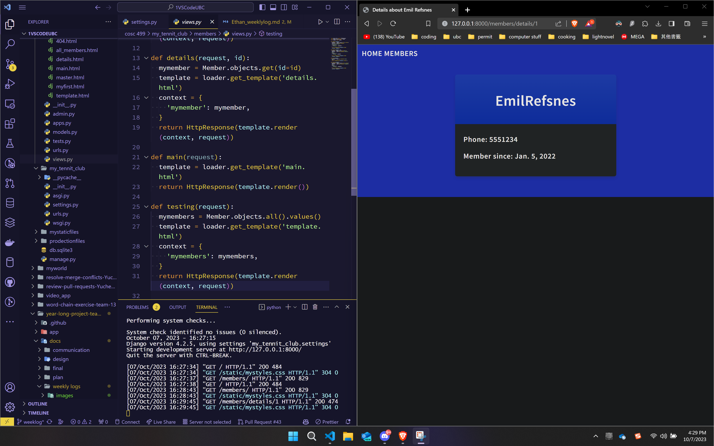
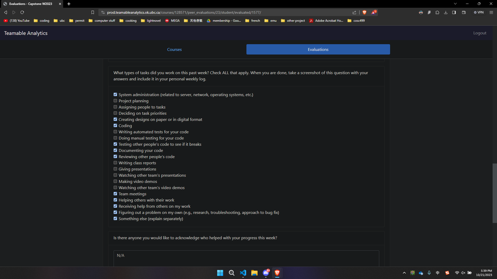

# Personal Week Log

- Applicable date range
- Type of tasks you worked on (screenshot from Peer Eval question)
- Recap on your week's goals-Which features were yours in the project plan for this milestone?
  - Which tasks from the project board are associated with these features?
  - Among these tasks, which have you completed/in progress in the last week?
  - Optional text: Additional context that we should be aware of

# Preferred name -> Ssc name -> Github name

- Ethan -> Ethan Hsu -> YuchenHsu

## Week 4 2023/09/25~2023/10/1

- Type of tasks you worked on (screenshot from Peer Eval question)

- This week, we worked on the project plan and made sure to distribute the work evenly.

# Preferred name -> Ssc name -> Github name

- Ethan -> Ethan Hsu -> YuchenHsu

## Week 5 2023/10/02~2023/10/08

- Type of tasks you worked on (screenshot from Peer Eval question)

- This week, I learned the basics of Django, making a simple exercise website. And searched for the template to be used for our project.
- The Tasks associated and completed is the *Learning Django basics and setup* task.
- Optional Text: The following images are from my practice website for Django
- Django Practice Website Homepage
  
- Django Practice Website Member List
  
- Django Practice Website Member Detail
  
- Django Practice Website Admin Page
  

# Preferred name -> Ssc name -> Github name

- Ethan -> Ethan Hsu -> YuchenHsu

## Week 6 2023/10/09 ~ 2023/10/15

- Type of tasks you worked on (screenshot from Peer Eval question)

- This week, me and the team started working on implementing the template for our project. We also chose our css/html template and started incorperating it into the django website we made.
- The task associated is "[Setting up the project Django base](https://github.com/COSC-499-W2023/year-long-project-team-13/issues/45)"**,** "[Home Page](https://github.com/COSC-499-W2023/year-long-project-team-13/issues/3)", "[CSS dev](https://github.com/COSC-499-W2023/year-long-project-team-13/issues/7)", "[User Interface Design](https://github.com/COSC-499-W2023/year-long-project-team-13/issues/6)".
- Optional Text: The following images are from the Django website template and the css template we chose. And the combining in progress.
- Django Website Template
  
- CSS Template
  
- Combining
  

# Preferred name -> Ssc name -> Github name

- Ethan -> Ethan Hsu -> YuchenHsu

## Week 7 2023/10/16 ~ 2023/10/22

- Type of tasks you worked on (screenshot from Peer Eval question)

- This week, I finished the homepage of the website. And the linking of the pages. So far, all the buttons link to their respective pages.

# Preferred name -> Ssc name -> Github name

- Ethan -> Ethan Hsu -> YuchenHsu

## Week 8 2023/10/23 ~ 2023/10/29

- Type of tasks you worked on (screenshot from Peer Eval question)

- This week, I worked on making the home page look better, creating the logo for our project, and making the test for homepage to make sure it links to all the other pages and tested with Selenium.
- The following images are the logo and the test for homepage respectively.
  - Logo
    
  - Test
    
    

# Preferred name -> Ssc name -> Github name

- Ethan -> Ethan Hsu -> YuchenHsu

## Week 9 2023/10/30 ~ 2023/11/05

- Type of tasks you worked on (screenshot from Peer Eval question)

- This week, I worked on refining the homepage test, and preparing for the presentation. I also worked on making sure the website top bar is consistent across all pages and displays the correct group name.
- I also helped with trying to figure
- The following images are the test for homepage.
  - Test
    
  - Test video
    
  - Presentation Prep
    

# Preferred name -> Ssc name -> Github name

- Ethan -> Ethan Hsu -> YuchenHsu

## Week 10 2023/11/06 ~ 2023/11/12

- Type of tasks you worked on (screenshot from Peer Eval question)

#### Did not save on the website so the TA cannot see the result.

- This week, I worked on making the UML diagram and also tried to host the project on AWS.
  - So far I have tried EC2, which is still in progress figuring out problems, Elastic Beanstalk, which doesn't like my login credentials, and Lambda, which I can't figure out how to install the dependencies without breaking the other stuff.
- The guides I tried includes the following:
  - [AWS Lambda](https://dev.to/vaddimart/deploy-django-app-on-aws-lambda-using-serverless-part-1-1i90)
  - [AWS Elastic Beanstalk](https://docs.aws.amazon.com/elasticbeanstalk/latest/dg/create-deploy-python-django.html)
  - [AWS EC2](https://blog.devgenius.io/how-to-deploy-a-django-project-on-an-amazon-ec2-instance-with-apache-875f925d0a9a)
- The following images are the UML diagram and the AWS stuff.
  - UML
    
  - AWS
    
    
    
    

# Preferred name -> Ssc name -> Github name

- Ethan -> Ethan Hsu -> YuchenHsu

## Week 11~12 2023/11/13 ~ 2023/11/26

- Type of tasks you worked on (screenshot from Peer Eval question)

- For week 11. I tried to host the website on AWS but had no success. Which took the entire week. For week 12, I worked on making the video list page look better, and also changed the add contacts page to make it more intuitive.
- The tasks associated are the following:

  - [Learning AWS and setup](https://github.com/COSC-499-W2023/year-long-project-team-13/issues/41)
  - [User Interface Design](https://github.com/COSC-499-W2023/year-long-project-team-13/issues/6)
  - [Add contact](https://github.com/COSC-499-W2023/year-long-project-team-13/issues/27)
  - [Github Pull Request For the Contact Page and Video List Page](https://github.com/COSC-499-W2023/year-long-project-team-13/pull/74)
  - [Github Pull Request I reviewed](https://github.com/COSC-499-W2023/year-long-project-team-13/pull/69)
- The following images are for the trials on AWS and the code I did for the Contact Page and the Video List Page.

  - AWS with SST: For this option, I was only able to make it host a dummy website, but not our project.
    
    
    
    
  - AWS EC2: For this one, I managed to have the virtual machine run our code and host the website, but I cannot access it from the internet. I tried to change the security group to allow all traffic, but it still doesn't work.
    
    
- These are images of the code I did on the Contact Page and the Video List Page

  - Contact Page
    
  - Video List Page
    
  - This is the test report for both the Contact Page and the Video List Page
    
  - This is the test report for the entire website
    

# Preferred name -> Ssc name -> Github name

- Ethan -> Ethan Hsu -> YuchenHsu

## Week 13 2023/11/27 ~ 2023/12/03

- Type of tasks you worked on (screenshot from Peer Eval question)

- This week, I reviewed and tested other people's code to merge them into master. I also worked on the video presentation plan and design documents. I am also in charge of putting the video together for the group.
  - Pull request I reviewed
    - [Request video](https://github.com/COSC-499-W2023/year-long-project-team-13/pull/86)
    - [Notifications](https://github.com/COSC-499-W2023/year-long-project-team-13/pull/82)
    - [Logout page layout updated](https://github.com/COSC-499-W2023/year-long-project-team-13/pull/81)
    - [Edit Profile Form Function Updated (username to First/Last name) / Testing](https://github.com/COSC-499-W2023/year-long-project-team-13/pull/80)

# Preferred name -> Ssc name -> Github name

- Ethan -> Ethan Hsu -> YuchenHsu

## Week 1 2024/01/08 ~ 2024/01/14

- Type of tasks you worked on (screenshot from Peer Eval question)

- This week, I worked on making s3 buckets working and setup cloudfront routing for the files stored in the s3 bucket for security reasons.
  - The files are stored in the s3 bucket and can be accessed through cloudfron with [this link](https://d18u3jaflgrcvn.cloudfront.net/media/Beautiful_City_SEA_VIEW___Creative_Commons_Videos___Free_HD_Videos_-_no_copyright.mp4)
  - The working webpage screenshot is as follows:
    - 
    - 
    - 
  - The tasks associated are the following:
    - [S3 Buckets](https://github.com/COSC-499-W2023/year-long-project-team-13/issues/96)

# Preferred name -> Ssc name -> Github name

- Ethan -> Ethan Hsu -> YuchenHsu

## Week 2 2024/01/15 ~ 2024/01/21

- Type of tasks you worked on (screenshot from Peer Eval question)

- This week, I worked on making the video list page, originally I was planning on working with one of the blurring features, but when the rds database was implemented the s3 bucket and cloudfront stopped working. So I had to work on fixing that.
  - The tasks associated are the following:
  - [S3 cloudfront branch](https://github.com/COSC-499-W2023/year-long-project-team-13/issues/96)
  - 
  - 

# Preferred name -> Ssc name -> Github name

- Ethan -> Ethan Hsu -> YuchenHsu

## Week 3 2024/01/22 ~ 2024/01/28

- Type of tasks you worked on (screenshot from Peer Eval question)

- This week, I worked on fixing the s3 cloudfront branch to try to make profile picture can be swapped out. That is the only thing that is not working right now.
- I also worked on the Upload Video Page and seperated the upload video part and the record video part so that on the same page the user can change whether they want to upload or record a video (default one is record).
  - The tasks associated are the following:
  - [S3 cloudfront branch](https://github.com/COSC-499-W2023/year-long-project-team-13/issues/96)

# Preferred name -> Ssc name -> Github name

- Ethan -> Ethan Hsu -> YuchenHsu

## Week 4 2024/01/29 ~ 2024/02/04

- Type of tasks you worked on (screenshot from Peer Eval question)

- This week, I worked on implementing the permission system to the website, I did the permission and form with Adrian's help.
- And I also worked on the page to make it display the correct information based on the user's permission.
- I also added a dropdown bar when registering to let the user define what kind of user they are.
- When a user selected a permission they will not be able to change it.
  - The user can choose from being a doctor or a patient when registering.
  - 
  - The message will be shown when the user access a page that they don't have permission to access.
  - 

# Preferred name -> Ssc name -> Github name

- Ethan -> Ethan Hsu -> YuchenHsu

## Week 5 2024/02/05 ~ 2024/02/11

- Type of tasks you worked on (screenshot from Peer Eval question)

- This week, I tried to make s3 work, managed to successfully download and upload to the s3 bucket.
- I also started working on aws rekognition and blurring faces, I have managed to blur a face on an image, but haven't gotten to do it on a video yet.
  - Here's the result of the blurring face on an image
  - 
- The tasks associated are the following:
  - [S3 cloudfront branch](https://github.com/COSC-499-W2023/year-long-project-team-13/tree/s3_cloudfront)
  - [Blur Face](https://github.com/COSC-499-W2023/year-long-project-team-13/tree/rekognition)

# Preferred name -> Ssc name -> Github name

- Ethan -> Ethan Hsu -> YuchenHsu

## Week 6 2024/02/12 ~ 2024/02/18

- Type of tasks you worked on (screenshot from Peer Eval question)

- This week, I worked on making the rekognition and face blurring work on videos, here's the guide I followed and failed to to make them work so far.
  - [rekognition with lambda](https://awstip.com/aws-rekognition-using-lambda-with-sqs-and-sns-part-1-ca66c37dad7e)
  - [SQS and SNS setup for lambda function](https://awstip.com/aws-rekognition-using-lambda-with-sqs-and-sns-part-2-b2eeca1a9c3d)
- I also worked on the record video page with Beth and designed the pages following the recording of the video.
  - 
  - 
  - 

# Preferred name -> Ssc name -> Github name

- Ethan -> Ethan Hsu -> YuchenHsu

## Week 7 2024/02/19 ~ 2024/02/25

- This week, I tried to make the blurring work with videos but so far I haven't have any success. I also worked on the linking of our database to the s3 buckets. So far the upload never goes into the bucket but it is trying its best.
  - This is the guide I followed:
    - [Uploading to the S3 and store the URL in the database](https://docs.aws.amazon.com/AmazonRDS/latest/UserGuide/PostgreSQL.Procedural.Importing.html)
  - 

# Preferred name -> Ssc name -> Github name

- Ethan -> Ethan Hsu -> YuchenHsu

## Week 8 2024/02/26 ~ 2024/03/03

- Type of tasks you worked on (screenshot from Peer Eval question)

- The past two weeks I worked with Beth to finish (and salvage) the record/upload video page
- Made the UIs and the preview work on the record page.
- Fixed multiple UI bugs on the record/upload video page.
- Also fixed the testing for the record/upload video page.

# Preferred name -> Ssc name -> Github name

- Ethan -> Ethan Hsu -> YuchenHsu

## Week 9 2024/03/04 ~ 2024/03/10

- Type of tasks you worked on (screenshot from Peer Eval question)

- I have been sick since last week (before the peer eval) so I haven't been the most productive for the project. I still showed up to most meetings to help with some minor problems.
- This week I worked on fixing some styling problems, namely the user videos, video details, and profile page. I worked on the video record page as well but haven't fixed that yet.
  - 
  - 
  - 

# Preferred name -> Ssc name -> Github name

- Ethan -> Ethan Hsu -> YuchenHsu

## Week 10 2024/03/11 ~ 2024/03/17

- Type of tasks you worked on (screenshot from Peer Eval question)

- This week, I worked with the team and merged the updates after the peer evaluation.
- Worked with Beth on making it so that when the user used the link from the notification to go to the record page, it does successfully go to the record page and the recordings gets successfully uploaded to the database.
- Updated the post video page styling when the website is hosted on the Elastic Beanstalk
  - The top horizontal buttons for switching between recording and uploading videos doesn't get overlapped under the top
  - The bottom buttons for going between pages, doesn't get blocked by the recording box.
  - 

# Preferred name -> Ssc name -> Github name

- Ethan -> Ethan Hsu -> YuchenHsu

## Week 11 2024/03/18 ~ 2024/03/24

- Type of tasks you worked on (screenshot from Peer Eval question)

- This week, I worked on the S3 uploading with Adrian. I managed to make it so that when a file is uploaded the file is store in the S3 bucket with their username as the folder name. (which is the primary key for the user that they cannot change).
- I also worked on making sure that if the user uploads a video or image, it wouldn't just replace the file with the same name, but instead add a number to the end of the file name.
- I also helped Beth on the record and upload page to display the video request detail.
  - Uploading function to check for duplicate names and specify location
  - 
  - 

# Preferred name -> Ssc name -> Github name

- Ethan -> Ethan Hsu -> YuchenHsu

## Week 12 2024/03/25 ~ 2024/03/31

- Type of tasks you worked on (screenshot from Peer Eval question)

- This week, I worked on the S3 and blurring functions with Adrian.
- I also reviewed and fixed tests for multiple branches to help with merging the branches to the master.
  - Reviews of the branches
    - [Forget Password](https://github.com/COSC-499-W2023/year-long-project-team-13/pull/203#pullrequestreview-1969709754)
    - [Notification](https://github.com/COSC-499-W2023/year-long-project-team-13/pull/202#pullrequestreview-1969704056)
    - [Request Detail](https://github.com/COSC-499-W2023/year-long-project-team-13/pull/201#pullrequestreview-1969681162)
    - [Test Fixes](https://github.com/COSC-499-W2023/year-long-project-team-13/pull/201#issuecomment-2027826755)
- I started the document for the final report and the video.
  - Started making the list of features we worked on.
  - Started updating Readme for the project.

# Preferred name -> Ssc name -> Github name

- Ethan -> Ethan Hsu -> YuchenHsu

## Week 13 2024/04/01 ~ 2024/04/07

- Type of tasks you worked on (screenshot from Peer Eval question)

- This week I worked on testing and merging all the rest of the branches.
- I also updated the readme of our project to reflect new changes and new setups needed, also added citations.
- I also worked on the final report and the video.
  - The following links are the approval of pull requests and the updated readme.
    - [Approval of pull requests](https://github.com/COSC-499-W2023/year-long-project-team-13/pull/204#pullrequestreview-1975102899)
    - [updated readme pull request 1](https://github.com/COSC-499-W2023/year-long-project-team-13/pull/211)
    - [updated readme pull request 2](https://github.com/COSC-499-W2023/year-long-project-team-13/pull/212)
