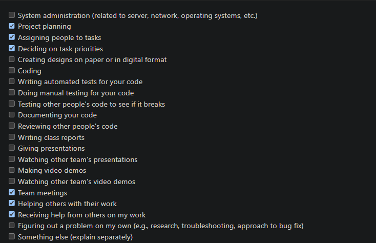
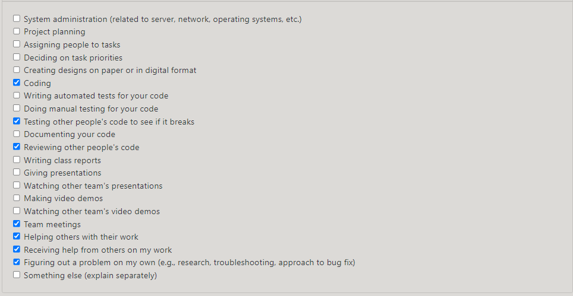
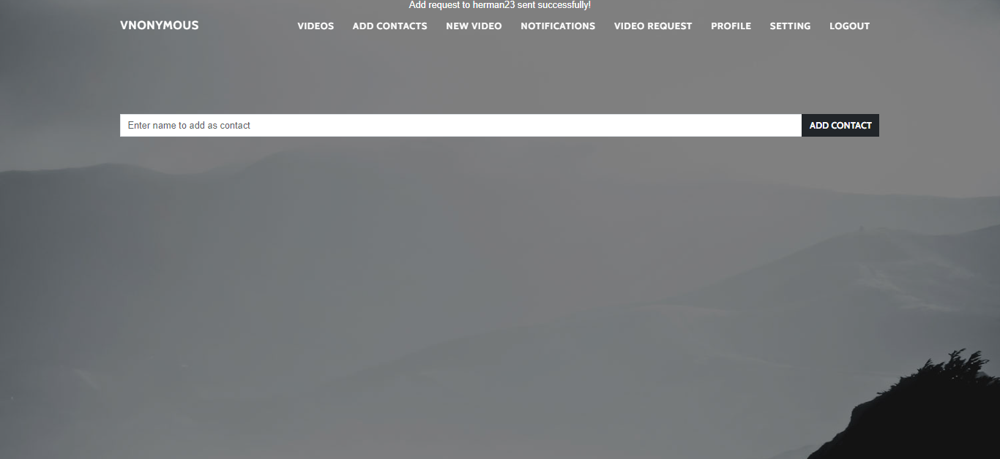
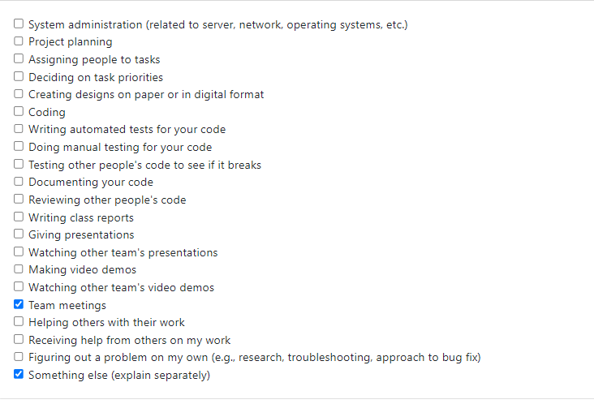

# Personal Week Log

- Applicable date range
##  Week 4 2023/09/25~2023/10/1
- Type of tasks you worked on (screenshot from Peer Eval question)

# Preferred name -> Ssc name -> Github name

- Herman -> Herman Sood -> Herman Sood

- Recap on your week's goals-Which features were yours in the project plan for this milestone? This week I worked with my team to work on the project plan.
 
  - Which tasks from the project board are associated with these features?
  The project plan.
  
  - Among these tasks, which have you completed/in progress in the last week?
  The project plan.

  - Optional text: Additional context that we should be aware of

  # Personal Week Log

- Applicable date range
##  Week 5 2023/10/1~2023/10/7
- Type of tasks you worked on (screenshot from Peer Eval question)

# Preferred name -> Ssc name -> Github name

- Herman -> Herman Sood -> Herman Sood

- Recap on your week's goals-Which features were yours in the project plan for this milestone? This week I worked on learning the basics of the framework Django and did some setup of it.
 
  - Which tasks from the project board are associated with these features?
  Learning Django basics and setup
  
  - Among these tasks, which have you completed/in progress in the last week?
  Learning Django basics and setup

  - Optional text: Additional context that we should be aware of

  
  

# Personal Week Log

- Applicable date range
##  Week 6 2023/10/8~2023/10/14
- Type of tasks you worked on (screenshot from Peer Eval question)

# Preferred name -> Ssc name -> Github name

- Herman -> Herman Sood -> Herman Sood

- Recap on your week's goals-Which features were yours in the project plan for this milestone? This week I worked on the project Django base setup with things like the Django environment files, connected homepage.html with the Django website, and implemented some CSS to the homepage. 
 
  - Which tasks from the project board are associated with these features?
  Setting up the project Django base and CSS dev. 
  - Among these tasks, which have you completed/in progress in the last week?
  Setting up the project Djang base (completed), CSS dev (in progress)

# Personal Week Log

- Applicable date range
##  Week 7 2023/10/15~2023/10/21

# Preferred name -> Ssc name -> Github name

- Herman -> Herman Sood -> Herman Sood

- Recap on your week's goals-Which features were yours in the project plan for this milestone? This week I worked on the create account and CSS dev associated with it. 
 
  - Which tasks from the project board are associated with these features?
  Create account and CSS dev.
  - Among these tasks, which have you completed/in progress in the last week?
 Create account and CSS dev. 

# Personal Week Log

- Applicable date range
##  Week 8 2023/10/22~2023/10/28

# Preferred name -> Ssc name -> Github name

- Herman -> Herman Sood -> Herman Sood

- Recap on your week's goals-Which features were yours in the project plan for this milestone? This week I worked on the create account where I made some fixes to make the register button function, did the register test using selenium and helped a little with login. I also helped with making the register button not allow for any duplicate accounts to be made and restricted things like password length and other variables in order to successfully create an account.
 
  - Which tasks from the project board are associated with these features?
  Create account and Login.
  - Among these tasks, which have you completed/in progress in the last week?
 Create account and CSS dev and login. 

 
 
 
 

 # Personal Week Log

- Applicable date range
##  Week 9 2023/10/22~2023/10/29

# Preferred name -> Ssc name -> Github name

- Herman -> Herman Sood -> Herman Sood

- Recap on your week's goals-Which features were yours in the project plan for this milestone? This week I worked on making some final changes to the register page including some minor updates to ensure the testing of the register page was good to go for the presentation. I also did the milestone 1 presentation with my team and helped out with the login a little bit. 
  - Which tasks from the project board are associated with these features?
  Create account and Login and Presentation Prep.
  - Among these tasks, which have you completed/in progress in the last week?
 Create account and Login nand Presentation Prep. 

 
 
 
 
 

 # Personal Week Log

- Applicable date range
##  Week 10 2023/11/4~2023/11/11

# Preferred name -> Ssc name -> Github name

- Herman -> Herman Sood -> Herman Sood

- Recap on your week's goals-Which features were yours in the project plan for this milestone? This week I worked on making a quick touch to the profile page and worked on edit profile. The main goal was to fix up the structure of the page and be able to upload new images and have them display when updating the page after refreshing. This was good but just some issues with the password. Also need a css template for the profile.  
  - Which tasks from the project board are associated with these features?
  Profile and editprofile
  - Among these tasks, which have you completed/in progress in the last week?
 profile an editprofile

 
 
 
 

- Applicable date range
##  Week 11-12 2023/~2023

# Preferred name -> Ssc name -> Github name

- Herman -> Herman Sood -> Herman Sood

- Recap on your week's goals-Which features were yours in the project plan for this milestone? For week 11 I worked on the profile page and helped setup the structure of the page. The profile image can be updated every time after refreshing. The css was also done for the design of the profile page. For week 12 I worked on the notification page and got the structure set up. It also has some css design to the page. More work in progress.
  - Which tasks from the project board are associated with these features?
  Profile and editprofile and Notifications
  - Among these tasks, which have you completed/in progress in the last week?
Profile and editeprofile and Notifications

 
 
 

- Applicable date range
##  Week 13 2023/11/27~2023/12/03

 

# Preferred name -> Ssc name -> Github name

- Herman -> Herman Sood -> Herman Sood

- Recap on your week's goals-Which features were yours in the project plan for this milestone? For week 13 I worked on the notifications page and then the design milestone with my team. For the notifications page I made sure to add the navigation to the navigation bar and made it so that it shows on every other page. Further I added some functionality in which any time a user logs into their account, on the notifications page they can see the day and the time they logged in and it will add to that each time they relogin. For the design milestone I wrote a few brief summaries of the all of the features. I also did the recording of my part of the video for the presentation. 
  - Which tasks from the project board are associated with these features?
  Notifications and Design Milestone
  - Among these tasks, which have you completed/in progress in the last week?
Notifications and Design Milestone

 

 - Applicable date range
##  Week 1 Term 2 01/08/24~01/14/24

 # Preferred name -> Ssc name -> Github name

- Herman -> Herman Sood -> Herman Sood

- Recap on your week's goals-Which features were yours in the project plan for this milestone? For term 2 week 1 I tried to work some more on the notifications but realized I cannot really do much until some functionality involving being able add a contact is done so I can get those notifications. Therefore, I am now working on and trying to get the add contact function to work properly. 
  - Which tasks from the project board are associated with these features?
  Notifications and Add Contact Function
  - Among these tasks, which have you completed/in progress in the last week?
Notifications and Design Milestone before Christmas break.

- Applicable date range
##  Week 2 Term 2 01/15/24~01/21/24

 # Preferred name -> Ssc name -> Github name

- Herman -> Herman Sood -> Herman Sood

- Recap on your week's goals-Which features were yours in the project plan for this milestone? For term 2 week 2 I added some functionality to the add contact branch in which one a user has a registered account, they have the ability to add any other existing contact and it will show a message on the top of the screen stating that the user was added successfully. If the user does not exist, then a message saying will show. I am now in the phase of writing a unit test for this. I should have probably written it prior to the functions for the add contact which I will try to be mindful of for future. 
  - Which tasks from the project board are associated with these features?
  Add Contact Function
  - Among these tasks, which have you completed/in progress in the last week?
Add Contact Function (testing left)
 
 

 
 

 - Applicable date range
##  Week 3 Term 2 01/22/24~01/28/24

 # Preferred name -> Ssc name -> Github name

- Herman -> Herman Sood -> Herman Sood

- Recap on your week's goals-Which features were yours in the project plan for this milestone? For term 2 week 3 I helped Raymond with the setting branch a little and wrote two unit tests in which one checks for valid passwords when doing a password change and the other test looks for invalid passwords. I also added in an additional validity checker where a user cannot add more than 4 of the same characters in a row in the password but that may be removed. I plan to get back to the add contact branch and get a search bar and everything once things are set on the database side from Adrian. 
  - Which tasks from the project board are associated with these features? Settings - Change Password
  - Among these tasks, which have you completed/in progress in the last week?
Settings - Change Password (unit tests),
Add contact in progress.

 

 

  - Applicable date range
##  Week 4 Term 2 01/29/24~02/04/24

 # Preferred name -> Ssc name -> Github name

- Herman -> Herman Sood -> Herman Sood

- Recap on your week's goals-Which features were yours in the project plan for this milestone? For term 2 week 4 I worked on the add contact branch and made modifications to the page. Now, there is a search bar on the page rather than a direct add contact and with the search bar you can search for existing users and add them. There is also a list of existing users with add contact buttons next to each user beneath the search bar. You can also search a user by typing a couple letters and search and the results will match the most closely associated users to add. Lastly I wrote a selenium test and updated unit tests for this. 
  - Which tasks from the project board are associated with these features? Add Contact function, Add contact UI
  - Among these tasks, which have you completed/in progress in the last week?
Add Contact Function, Add contact UI

 

 
 
  - Applicable date range
##  Week 5 Term 2 02/05/24~02/11/24

 # Preferred name -> Ssc name -> Github name

- Herman -> Herman Sood -> Herman Sood

- Recap on your week's goals-Which features were yours in the project plan for this milestone? For term 2 week 5 I worked on a new branch that I created called view_video. What I have done so far is that for videos that get uploaded, admin users can go to the admin page and can see all the videos that have been uploaded under posts in stream. I plan to try and make changes next though to the view video page next because on that page it doesnt show the new uploaded videos at the moment. 
  - Which tasks from the project board are associated with these features? View video function
  - Among these tasks, which have you completed/in progress in the last week? Started new task so just view video in progress right now. 

 
  

- Applicable date range
##  Week 6 Term 2 02/12/24~02/18/24

 # Preferred name -> Ssc name -> Github name

- Herman -> Herman Sood -> Herman Sood

- Recap on your week's goals-Which features were yours in the project plan for this milestone? For term 2 week 6 I unfortunately ran into some issues with my laptop and was unable to get anything done. I did attend the meeting however and am on base with the team for what we are planning to do for the peer testing 2 coming up in a few weeks. I hope to get some more stuff done over the break which is my goal with a balance of all my other courses. 
  - Which tasks from the project board are associated with these features? View video function
  - Among these tasks, which have you completed/in progress in the last week? View video in progress right now. 

 - Applicable date range
##  Week 7 Term 2 and Week 8 Term 2 02/19/24~03/03/24

 # Preferred name -> Ssc name -> Github name

- Herman -> Herman Sood -> Herman Sood

- Recap on your week's goals-Which features were yours in the project plan for this milestone? For term 2 week 7(the reading break) I went on to help Raymond with some unit tests for the setting page to check for valid and invalid passwords and the form setting. I also helped out with the html/css to fix the issue of the text overflowing from the box when the screen size is shrunk. For week 8 I worked on the view video page and made some changes to get videos that are uploaded by the user to be viewable. I also made a small touch to the register page in which now instead of black text that shows indicating a potential error a user has made when registering for an account, the text is in red for ease of user viewability.  
  - Which tasks from the project board are associated with these features? View video function, Setting Page UI 
  - Among these tasks, which have you completed/in progress in the last week? View video function and Setting Page UI.

- Applicable date range
## Week 9 Term 2 03/04/24~03/10/24

 # Preferred name -> Ssc name -> Github name

- Herman -> Herman Sood -> Herman Sood

- Recap on your week's goals-Which features were yours in the project plan for this milestone? For term 2 week 9, after the second peer evaluation session in class, my team and I discussed on features to be done or updated for the coming weeks and so we prioritized and assigned all members with some tasks to do and updated the Kanban board accordingly. I will be working on some of the UI updates for the upload video page and then later work on the password viewable on the login and register page afterward. 
  - Which tasks from the project board are associated with these features? Upload video page UI updates and Password viewable.  
  - Among these tasks, which have you completed/in progress in the last week? Upload video page UI. 

- Applicable date range
## Week 10 Term 2 03/11/24~03/17/24

 # Preferred name -> Ssc name -> Github name

- Herman -> Herman Sood -> Herman Sood

- Recap on your week's goals-Which features were yours in the project plan for this milestone? For term 2 week 10, I fixed the UI structure for the upload video page to match the structure of page for sending a video. I also implemented a password viewable feature on the register page and almost finished doing the same thing for the login page using an eye icon that can be toggled to view or hide password when registering or logging into an account. I am also planning to add the feature to the setting page where users are able to create a new password if they want to change their password.
  - Which tasks from the project board are associated with these features? Upload video page UI updates and Password viewable.  
  - Among these tasks, which have you completed/in progress in the last week? Upload video page UI and Password Viewable. 

- Applicable date range
## Week 11 Term 2 03/18/24~03/24/24

 # Preferred name -> Ssc name -> Github name

- Herman -> Herman Sood -> Herman Sood

- Recap on your week's goals-Which features were yours in the project plan for this milestone? For term 2 week 11, I wrapped up the password viewable feature for the register, login, and setting page where it was applicable and adjusted the UI accordingly as well. I also updated the selenium test to ensure everything is good to go with these changes. Now I am going to start on a notification indicator feature in which a red number with a circle icon or something similar will be an indicator for whenever a user gets any new notifications. 
  - Which tasks from the project board are associated with these features? Password viewable, Notification Indicator  
  - Among these tasks, which have you completed/in progress in the last week? Password viewable

- Applicable date range
## Week 11 Term 2 03/18/24~03/24/24

 # Preferred name -> Ssc name -> Github name

- Herman -> Herman Sood -> Herman Sood

- Recap on your week's goals-Which features were yours in the project plan for this milestone? For term 2 week 12, I worked on the notification indicator feature in which the receiver will get a notification if they receive a friend request or a video request for example and this is seen as a number within a red border on any page that they are on (for example on the home page or on the profile page) directly on the notifications bar. If the receiver gets multiple notifications the number increments and once they go to the notifications page the notifications indicator sets back to 0 since the notifications are now all marked as read. I also updated the selenium test for the notification test to highlight the indicator addition. 
  - Which tasks from the project board are associated with these features? Notification Indicator  
  - Among these tasks, which have you completed/in progress in the last week? Notification Indicator

- Applicable date range
# Preferred name -> Ssc name -> Github name

- Herman -> Herman Sood -> Herman Sood

## Week 13 2024/04/01 ~ 2024/04/07

- Recap on your week's goals-Which features were yours in the project plan for this milestone? For term 2 week 13, I worked on the final project report and video.
  - Which tasks from the project board are associated with these features? Final Video creation, Final Video editing, Final Individual Report and Documentation.

