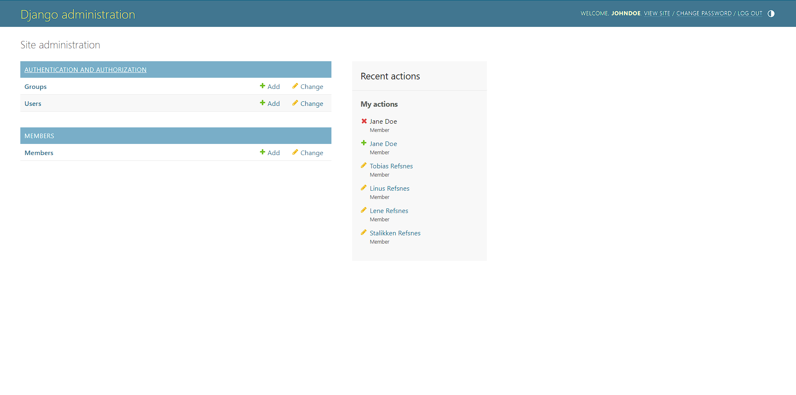
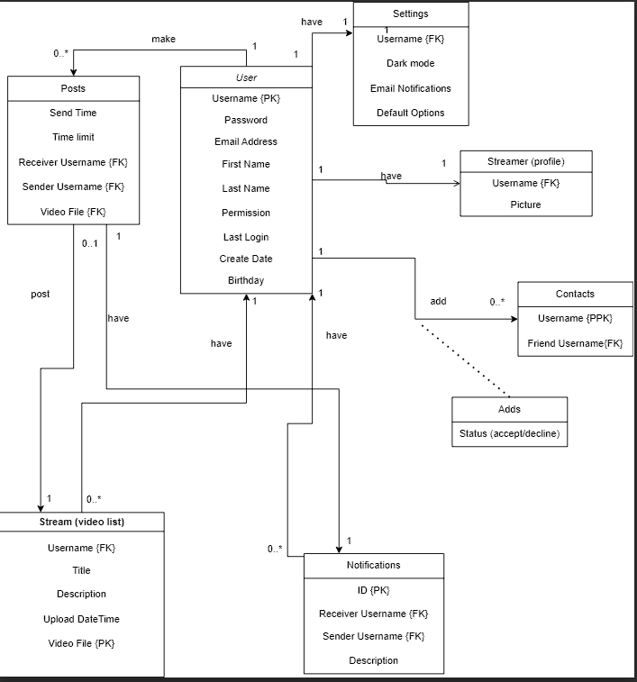

## Personal Week Log

- Applicable date range
- Type of tasks you worked on (screenshot from Peer Eval question)
- Recap on your week's goals
- Which features were yours in the project plan for this milestone?
- Which tasks from the project board are associated with these features?
- Among these tasks, which have you completed/in progress in the last week?
- Optional text: Additional context that we should be aware of\

# Preferred name -> Ssc name -> Github name

- Raymond -> Sitt Paing -> SittHmuePaing

## Week 4 2023/09/25~2023/10/1

-Types of tasks that I have worked on

## Recap of week's goals
I collaborate with my team to discuss and work on the project plan, team weekly log and completed my personal weekly log.

## Week 5 2023/10/02~2023/10/08

-Types of tasks that I have worked on

## Recap of week's goals
I collaborate with my team to discuss on the project templates we would like to use and learn a new framework django and work on the setup to use for our project from W3schools.com. I also worked on my weeklylog and contribute in teamlog for this week.

-Optional text: Below are some images of practice i have done using Django

-Django coding

-The list of members

-Home page for Admin

-The list of members on admin page(after practicing adding and deleting members)

## Week 6 2023/10/09 ~ 2023/10/15

-Types of tasks that I have worked on

## Recap of week's goals
For this week, we started working on the html/css template that we choose for our project previously and do implementation in the django website that our team made. I also contribute in resolving the issue where django is not loading the css by searching different online resources.

## Week 7 2023/10/16 ~ 2023/10/21

-Types of tasks that I have worked on

## Recap of week's goals
For this week, I worked on html/css template for the login and video page, and also help my team to fix bugs and issues by searching for online solution and utilize them when we are working on the templates.

## Week 8 2023/10/22 ~ 2023/10/28

-Types of tasks that I have worked on

## Recap of week's goals
For this week, we worked on the login/register page making changes to html/css and work on the function of the login and register pages. Also we tested the code frequently to see whether the website return the output that we are expecting to see. I also work on the test code for the login page to check whether the login is successful or not. Any bugs and issues that have arises during coding is also fixed along the way when working on the website through searching online for external resources to tackle the problems.

Register Page

Login Page

Login Testing

Login Testing Successful

## Week 9 Week 9 2023/10/30 ~ 2023/11/05

-Types of tasks that I have worked on

## Recap of week's goals
For this week, we worked on our presentation as well as prepare for a live demo for our presentation. We also fixed any existing bugs and issues when doing the live demo and make changes/fix the html/css of the pages(profile, login and logout). We also made preparation on the google docs for the presentation on what we want to present.

Presentation Prep

My Presentation Part

Profile Page

Logout Page

Login Testing

Login Testing Successful

## Week 10 2023/11/6 ~ 2023/10/12

-Types of tasks that I have worked on

## Recap of week's goals
For this week, we worked on the UML diagram for SQL database restructure. I also search online for suitable profile template from various websites to use for our project as well as use online resources to gain insight on how to work on change password. I also contribute in changing the structure as well as CSS for the template and help my team members to fix issues/bugs, when doing the project.

Searching online to gain insight for Change Password

UML Diagram

Profile Template

## Week 11~12 2023/11/13 ~ 2023/11/26

-Types of tasks that I have worked on

## Recap of week's goals
For these weeks, I work on the setting page where the user can change the password as well as change the theme of the page to either dark/light. I have worked on the html and css for both the pages and link them to the respective button/link. I make some changes on some of the pages to add the setting button for the user to go to setting page as well as add codes for showing notification which notifying the user whether they want to log out of the page on both the setting and theme page. I fix the issue that affect my setting/theme page css and html as well as work on the function of changing theme which is still in progress. I am also collecting some idea on how to work on change password on the setting page although there are some codes already done but its commented out at the moment. Me and my team also discuss on what to be done before the presentation and what we should present for the presentation and assigning task priorities.

Adding of Setting button on the header bar

Worked on Setting page with setting button added

Worked on Theme page with setting button added

Worked on Notification message on setting page

Worked on Notification message on theme page

Commits

Setting Code

Theme Code

Theme css

Theme js (still in progress)

.png)

Change Password Code (Commented Out)

## Week 13 2023/11/27 ~ 2023/12/03

-Types of tasks that I have worked on

## Recap of week's goals
For this week, I work on the test for the setting and theme to check the linking of the page and both are successful after fixing issues that is throwing an error. I also fix the function of the theme since it is not working and its is currently working but need some fixing on the css as well as I have fixed/changed html/css of setting and theme webpage. I also worked on the design document and collaborate with the team to draw diagram like DFD diagram, ER diagram, system architecture diagram and write a document and also contribute in the making of video demo for our project.

Test for Setting Page

Test for Theme Page

Test Successful for Setting Page

Test Successful for Theme Page

Commits

Light(Original) Mode for the Theme

_Mode.png)

Dark Mode for the Theme

## Term 2 Week 1 2024/01/08 ~ 2024/01/14

-Types of tasks that I have worked on

## Recap of week's goals
This week, we discussed during the team meeting about what we have done in term 1 and list them out so we know what we need to work on for this term as well as update our Kanban Board and focus on the matter at hand. I have worked on change password/confirm password but there are issues that need to be fixed since the new password input does not overwrite the old password in the database so the user cannot log in with the new password. I am also trying to figure out on the theme page by learning through online resources since the theme function need to be applied to all the pages, not just one page.

Discussion and Making Lists of Things to be done

Coding for change/confirm password (in progress)

### Additional
- Worked on my own weekly log, contribute to team weekly log.
- Discuss with teammates to clarify doubts and things that need to be focus on.
- Learn new information from online to use for my project.

## Term 2 Week 2 2024/01/15 ~ 2024/01/21

- Type of tasks you worked on

## Recap of week's goals

For this week, I have worked on the change password/confirm password and remove unnecessary things in html on the setting page and make some adjustment to the page. The original plan was to finish the change/confirm password and jump to new task and get a head start, but they are some delays due to coding issues. I was assuming that it’s the database problem since previously the new password entered by the user is not working. After the database is fixed, the problem still exists, and I have to check my code to make some changes in html as well as other interconnected files (forms.py , views.py, urls.py). After changing everything which is necessary, the problem still exist much to my utmost frustration, which are the forms for user input required for changing password is missing but instead, the login form that is from different page is appearing on the setting page which makes me, and my team members perplexed when I run my code although the code in the setting page is there without any errors. Due to this problem, I have tried numerous solutions online trying to tackle on how to make just a single original form appear to make password change. I asked my teammate members for assistance but they could find the solution but during the weekend, much to our surprises, me and Adrian find the problem that cause the issues which is just a careless mistakes (shows no error but the code used in that line is wrong in the urls.py) which make us feel very annoyed but in the end the user is now able to change password and able to login with new password and I am working on confirm password during the weekend the code throws no error but not working as intended so currently i commented them out so that i does not affect the current working program. On the other hand, I have started searching up on how to view date/time for my later task using online resources so that i am prepared in advance.

Adjustment to html and Removal of unnecessary stuffs

Changes to forms.py and commented out code for confirm password

Changes to views.py and commented out code for confirm password

Changes to urls.py

Change password (current html)

### Additional
- Worked on my own weekly log, contribute to team weekly log.
- Learn new information from online to use for my project.

## Term 2 Week 3 2024/01/22 ~ 2024/01/28

- Type of tasks you worked on

## Recap of week's goals

I have worked on the confirm password function as well as add in different validity checker in the change password function for security. I encountered different issues such as validity checker not working as intended. One validity check that i have issue is that the user is allowed to change password that is similar to either either username or email, so i added a validity checker to tackle that issue, I used different online resources to resolve the issue but i am somehow able to prevent the user from changing their password similar to username but not an email unless the user put the exact email address as their password. It took me quite a while to tackle that problem until I use regular expression and worked with together with Adrian to overcome this issue. Now the user is able to change their password without any issues with a working validity checker. Herman helped me with the test and I made some changes to the test so that its run without any errors. I also make changes on the html/css although its not entirely working as some button and the form is out of place as well as we also discussed on what we want to present during the peer evaluation during our team meetings.

Adjustment to html and checking the password (too common)

checking the password (all numeric)

checking the password (missing number/punctuation)

checking the password (Short)

checking the password (similar to email/username)

checking the password (not matching with confirm password)

Test for setting

### Additional
- Worked on my own weekly log, contribute to team weekly log.
- Learn new insights from online to resolve issues for my project.

## Term 2 Week 4 2024/01/29 ~ 2024/02/04

- Type of tasks you worked on

## Recap of week's goals

This week my teammates prepare for our peer evaluation on what we want to present to the users and what tasks we would like the users to test on our website. My teammates discuss about what we need to make changes based on the feedback we received during the peer evaluation as well as plan and clarify doubts about tasks we need to prioritize on for our project.  After peer evaluation, I worked on html/bootstrap on my setting page since it is out of place(also received a feedback about making adjustment) so I fixed the issues, although it takes quite some time for making adjustments due to issues encountered but now it appear on the setting page that we have intended. I also added basic instruction on the setting to let the user know ahead on what the password should include before they changed their password. I also added the notification pop up which is a suggestion that we received form feedback to let the user confirm before they change their password instead of password changed directly once the save changes button is clicked. I encountered various issues like the notification pop up not showing up when the save changes button but instead change password directly, also see the pop up notification for a few second when save changes is clicked and password changes, and password changes when we clicked on either update or cancel button on the notification but which is not what I wanted it. I searched for online resources as well as get helped from my teammates to tackle the issues but took quite a while before its works as we intended.

List of things we want to present for our peer evaluation

Feedback that we have received from others during peer evaluation

Adjustment to html/bootstrap and added instruction for password change

Added Notification Pop up when user clicked save changes

Throwing message if the password is not filled after update button is clicked

Updating Password and Pop up Notification

### Additional
- Worked on my own weekly log, contribute to team weekly log.
- Learn new insights from online to resolve issues for my project.
- Currently planning to work on old password validation(suggestion received from evaluation feedback) to check for the user old password before changing to a new password.

## Term 2 Week 5 2023/02/05~2023/02/11

- Type of tasks you worked on

## Recap of week's goals
This week I worked on setting page based on the feedback i received from the peer evaluation and i have currently added an old password form for the user to add in their old password before changing to the new password. If the user added in the wrong old password and proceed to change the password, they will received and error message, saying that the old password they entered is incorrectly and asked them to try again. If the user added the correct old password but set the new password as the old password again, they will also received and error message saying that they cannot see an old password as a new password and ask the user to try again. If they user put in the correct password and set their different password for new password, they will be able to change their password without any issue. It take me quite awhile to do them since they are not working as intended like the not throwing error messages when user set the new password as their old existing password, the system not comparing the new password and old password and error message not showing up when the user input the wrong password but I am able to fixed them with the help of online resources and try working in my own way. I also add one more instruction in the setting page so that you know exact what they do to mind before changing their password. I also made some adjustment to the html and css since the stuff on the page went out of page when the user minimize or maximize the page but its still not functioning as expected so i am currently working on it. Also for the tests i am also checking on it to see what i need to make changes and test on since i have made various changes. I have tried working on selenium test but its not working as intended so I am currently working on it for the following week.

Adding old password form and instruction

Putting Wrong old password

Old password the same as new password

### Additional
- Worked on my own weekly log, contribute to team weekly log.
- Learn new insights from online to resolve issues for my project.
- Currently working on the html/css as well as on the tests for the setting page.

## Term 2 Week 6 2024/02/12 ~ 2024/02/18

- Type of tasks you worked on

## Recap of week's goals

This week, I have worked on the UI of setting page since the issue occurs when the users minimize or maximize the windows and I tried to make various changes to identify the issues but as of now I am unable to find out the root cause of an issue after trying for quite sometime so I move on to work on my selenium test for the setting page to see whether the functions in the setting page is working. First off, I checked whether all the forms and the buttons are clicked one by one and if successfully, the test moved on to the form to fill in the existing password, new password and confirm password and save changes and update it. Once successfully it will redirect to login to login with the new password. Finally after that is done, I made the test in the way so that once login in is successful with new passwords, change back to the original password (the starting password). While doing those I encountered various errors but I am able to solve them and work my way through with the help of one of my teammate, Beth. Also I worked on the unit test for the setting page but I encountered errors due to my lack of knowledge of python unit test so I planned to ask my teammates for help so that I learn and finish it at the same time. Our team also come up with the draft for what we want to present for our upcoming peer evaluation and questions that we may have to clarify with the professor.

### Additional
- Worked on my own weekly log, contribute to team weekly log.
- Learn new insights from online to resolve issues for my project and for the theme page.

##  Term 2 Week 7 and Week 8 02/19/24~03/03/24

- Type of tasks you worked on

## Recap of week's goals

During Week 7 (the reading break), I try to fix the html/css problem on my setting page by making various changes to identify the issue but its does not work due to my frustration but I am able to overcome this issue with the help of my teammate, Herman as well as Herman help me with my unit tests for my setting page, since its has issue when I am working on it. Now the elements on the setting page is no longer moving when the user zoom in or zoom out of the window.

During week 8, I tried to work on the theme page and I am able to create the toggle button but the the issue is that when the toggle button is made, the forms on the setting page disappeared due to my surprise so I give it another try by starting from the scratch but its also give off another issues like the toggle button shape not changing (sun for light and moon for dark) when the user want to change to dark mode. My teammates and I later decided to leave the theme the page since its not that much of a priority and focusses on tasks that we want to show for the upcoming peer evaluation. I also worked on together with Herman to make the error message red instead of black to improve the user's viewability on pages and Herman works on register page and I work on my setting page and login page.

Setting page fixed

Setting Page Zoom In

Setting Page Zoom Out

Red Error Message Login Page

Red Error Message Setting Page (Old)

### Additional
- Worked on my own weekly log, contribute to team weekly log.
- Learn new insights from online to resolve issues for my project and for the theme page.

## Term 2 Week 9 2024/03/04 ~ 2024/03/10

- Type of tasks you worked on

## Recap of week's goals

This week, we discussed on what we want to present for our second peer evaluation (we made the lists during week 6 in advance but we finalize on things we want to show to the user this week) and come up with what we want to present and do the task so that we are fully prepared for the evaluation. We meet up on Monday before the evaluation on Tuesday and try those lists that we want to show by ourselves to ensure everything is working and fix any issue that might have occur when we are testing our website so that we are well prepared. After the evaluation, we received feedbacks on what changes we can made to improve our website so on Thursday during our meeting, we discuss about what we should prioritized on and what are the changes that we need to take note of from the feedback that would make our website function better and make it easy to use for the users so we split the workload based on priority and focus on them. I worked on hiding the button (send video or request video) based on whether the user is the sender or receiver. It is based on the feedback we received during the second peer evaluation. If the user is the receiver, the send video button is hidden and if the user is the sender, the request video button is hidden but for admin, the user is still able to access both features. When working on it, the issue I encounter is that I forgot to take note of admin when i am doing verifying whether the user is sender/receiver and hide the button according so when admin login to the website, both features are missing so I have to check the issue and later I am able to fix that with the help of my teammate Adrian. I also have another issue with the syntax since in django we use and/or instead or && or || so I have to take note of it and I am able to overcome the obstacle and now the website is working as I have intended. I have to make changes on every pages that has top bar so that the button will be hidden based on the user's status. I also run both the pytest and selenium test again so that its working properly since i made changes and all tests pass.

Finalize Lists of what we want to present

Second Peer Evaluation Feedback

Hide Send Video Button for Receiver

Hide Request Video Button for Sender

Admin send/request video

### Additional
- Worked on my own weekly log, contribute to team weekly log.
- Looking at how to work on forgot password on the login page so that user can reset the password when they totally forgot their password by getting a reset link through email and change to a new password.

## Term 2 Week 10 2024/03/10 ~ 2024/03/17

- Type of tasks you worked on

## Recap of week's goals

This week our teammates run all the tests again on different laptops to see if there is any errors in both the selenium tests and pytests and discuss what the cause of the issues and fix the bugs/issues so we currently got all our tests running without any issues. I am currently working on the forgot password, where the user is allowed to reset their password if they can't recall their existing password by just providing their email so that the reset password link can be sent to them for making a new password and they will be able to login with their new password. I am currently working on creating different pages that would be necessary for resetting the password and trying to link the pages with button but I am currently having trouble in linking since there are some error that I am encountering when I try to click on the button that I have linked with another pages. I have watch different youtube video to gain some insights and to try to help me to understand better so that I can work on my task smoothly without much of an issues. The task is currently in progress and I am trying on my own to see whether I can resolve the issues and keeping working on the later parts.

Password password form after forgot password link is clicked

Link the button after send me instruction button is clicked (in progress)

### Additional
- Worked on my own weekly log, contribute to team weekly log.
- Looking at different youtube videos to gain insights on how to work on forgot password on the login page so that user can reset the password when they totally forgot their password by getting a reset link through email and change to a new password.

## Term 2 Week 11 2024/03/18 ~ 2024/03/24

- Type of tasks you worked on

## Recap of week's goals

This week, I worked on the forgot password UI and make changes to the register page. I created a new branch to make the forgot password UI and add the security questions and answer form on the register page so that user can choose their security question and put in the answer before they register. The aim of this feature is for resetting the password in case if user forgot the password they will be asked to provide their username, email and the security question will appear so that they can input their answer and the password can be reset if the user input the correct answer. I was going to do the reset password by receiving email but its a tough task and its will be time consuming without guarantee that its going to function as expected so we come up with another solution which is making use of security question and answer to reset the password which will be easier compared to receiving email. When working on the task, the issue i have on the register page is that the form is not appearing when i try to make the spinner for questions and form for answer so I have to troubleshoot and get help from my teammate to overcome the issue. Now I am working on forgot password UI and its still in progress. I am currently making the form appear on the page so that user can input their username, email and security answers to reset the password but the form are not appearing as expected so I am trying to tackle this issue and link it to another page if it is successful and user input the correct answer.

Security question spinner and answer form on register page

Password form after forgot password link is clicked(in progress)

.png)

### Additional
- Worked on my own weekly log, contribute to team weekly log.
- Trying on forgot-password UI to work by searching online to tackle the issue and will be getting help if needed from my teammates.

## Term 2 Week 12 2024/03/24 ~ 2024/03/31

- Type of tasks you worked on

## Recap of week's goals

This week me and my team member Beth finished up the forgot password function so that user can easily reset their password in case they forget their existing password. When the user clicked on the forgot password, they will be sent to forgot password page where they will be asked to provide username and email. If they don’t much their existing username/email, the website will give and error to prevent the user from going further. If the user input for both username/email matches, the security question that they used in during registration will appear for them to answer. If the answer matches their existing answer the user will be sent to password reset page, if not error message will appear for the user to try again. On forgot password page, similar to setting page, they will be asked to provide their new password and they need to confirm their password if its matches and if the password meet the requirements, the user will be able to log in with their new password when they are redirect to login page after the password change is successfully. Beth helps me with the forgot password function and also help me write the test for the forgot password and the test passed and the forgot password function is also working as expected. I also made adjustments to the html/css of the page design and the error message so that its in place and Herman assist me to add the password viewable button on the password reset page so that user can view their password for double checking.

Forgot Password Form

Error Message Forgot Password if user input wrong username and email

Security answer form and error message if user input wrong answer

Password Reset Page

### Additional
- Worked on my own weekly log, contribute to team weekly log and the report document.

## Term 2 Week 12 2024/03/01 ~ 2024/03/07

- Type of tasks you worked on

## Recap of week's goals

For this week, I work on my report and video demo that needed to be submitted as per requirement. I attend the team meeting to discuss about what features we worked on and how many features we must describe in our report. We condense some features so that our features only take 5 pages and discussed about how to work on the DFD Level 1 diagram. We helped one another and discussed about the report and update the Readme file for the client. I also worked on the video demo so that the person who is checking our website can check how to use our website and to gain insight.

### Additional
- Worked on my own weekly log, contribute to team weekly log.
- Contributed in working on Readme file.
