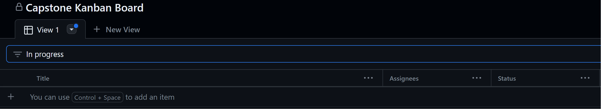
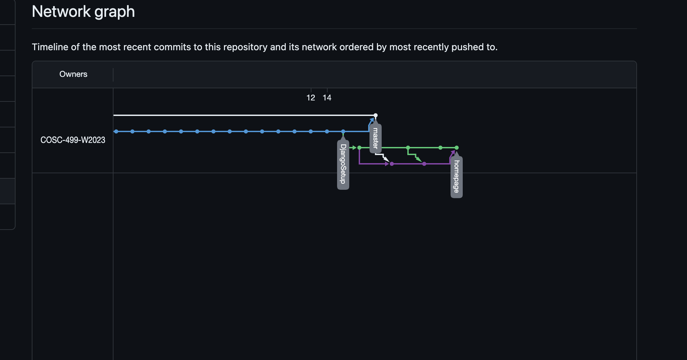
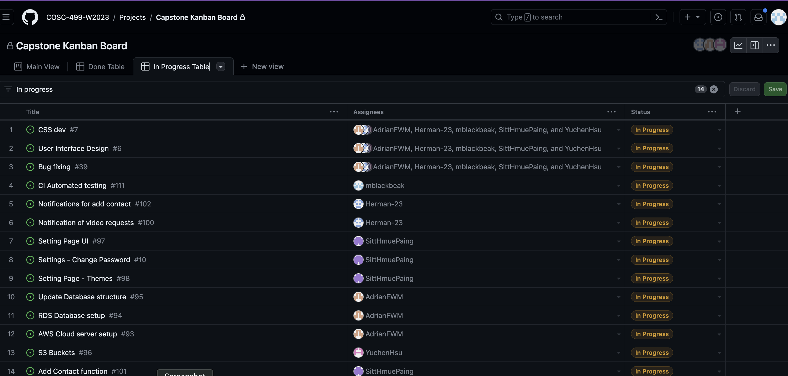
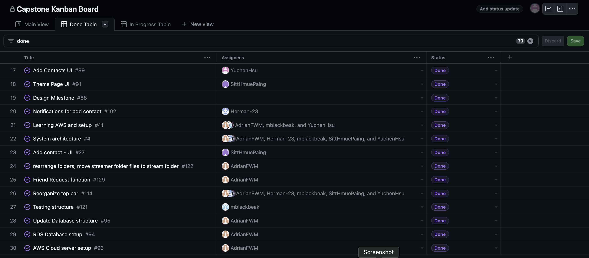
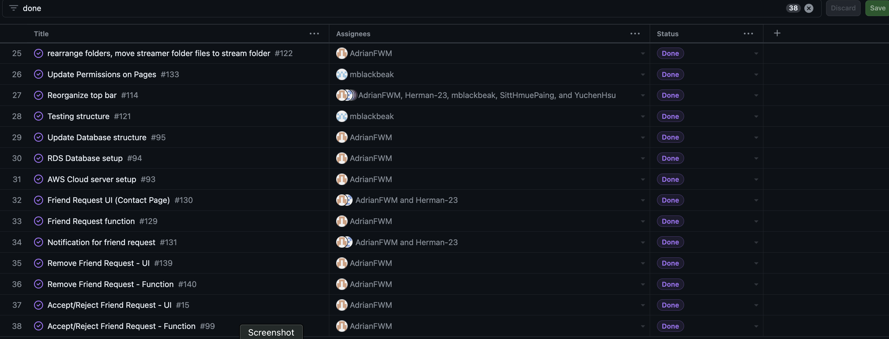
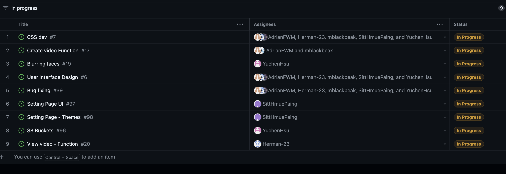
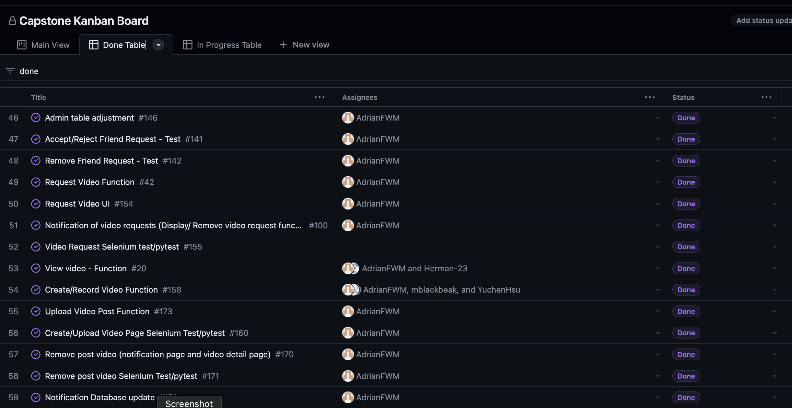
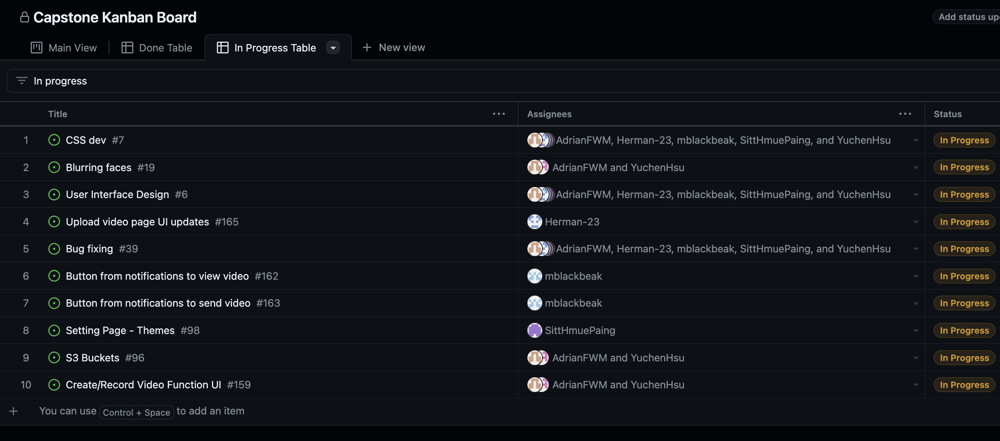
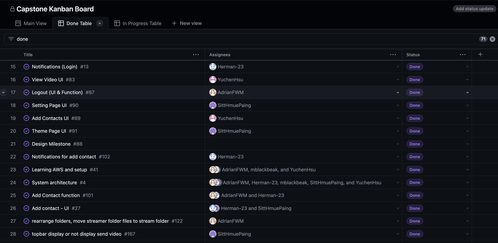
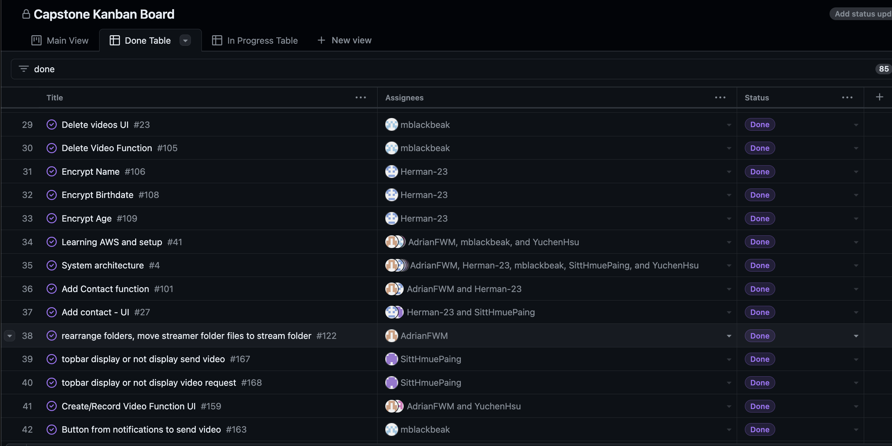

# Expected

- Team name with work performed start date to end date
- Recap your milestone goals:
  - Which features were in the project plan for this milestone?
  - Which tasks from the project board are associated with these features?
- Burnup chart (velocity)-Quick reminder of username → student name
- Table view of completed tasks on project board (by which username)
- Table view of in progress tasks on project board (by which username)
- Test report
- Optional text: Additional context that we should be aware of
-

## Preferred name -> Ssc name -> Github name

- Ethan -> Ethan Hsu -> YuchenHsu
- Beth -> Beth Ralston -> mblackbeak
- Herman -> Herman Sood -> herman-23
- Raymond -> Sitt Paing -> SittHmuePaing
- Adrian -> Adrian Fong -> AdrianFWM

## Week 4 2023/09/25~2023/10/1

- Which features were in the project plan for this milestone?
  - We worked on the project plan and made sure to distribute the work evenly.
- Which tasks from the project board are associated with these features?
  - The project plan is called **Project Plan** on the Kanban board.

Burnup chart

Network Graph

Completed Tasks

In progress Tasks

Tests

- Tests: We don't have any code this week so there's no tests to run.

## Preferred name -> Ssc name -> Github name

- Ethan -> Ethan Hsu -> YuchenHsu
- Beth -> Beth Ralston -> mblackbeak
- Herman -> Herman Sood -> herman-23
- Raymond -> Sitt Paing -> SittHmuePaing
- Adrian -> Adrian Fong -> AdrianFWM

## Week 5 2023/10/02~2023/10/08

- Which features were in the project plan for this milestone?
  - We worked on learning the basics and setup of our tech stack, namely Django. Each of us created our own local website and made sure that we could run it.
- Which tasks from the project board are associated with these features?
  - The task is called **Learning django basics and setup.**

Burnup chart

Network Graph

Completed Tasks

In progress Tasks

Tests

- Tests: We don't have any project code this week so there's no tests to run.

Optional Text:

- The bulk of this week's project progression is on individual learning of the django framework by following the online tutorial [W3School Django Tutorial](https://www.w3schools.com/django/index.php).
- The results of each of the team members' websites are in the individual logs.

## Preferred name -> Ssc name -> Github name

- Ethan -> Ethan Hsu -> YuchenHsu
- Beth -> Beth Ralston -> mblackbeak
- Herman -> Herman Sood -> herman-23
- Raymond -> Sitt Paing -> SittHmuePaing
- Adrian -> Adrian Fong -> AdrianFWM

## Week 6 2023/10/9 ~ 2023/10/15

- Which features were in the project plan for this milestone?
  - We worked on setting up the basic framework of a Django website and implemented some parts of css.
  - We searched for and decided on the template we want to use for html and css.
  - We started combining the css template with the Django website.
- Which tasks from the project board are associated with these features?
  - We completed "[Setting up the project Django base](https://github.com/COSC-499-W2023/year-long-project-team-13/issues/45)"**.**
  - We started on "[Home Page](https://github.com/COSC-499-W2023/year-long-project-team-13/issues/3)", "[CSS dev](https://github.com/COSC-499-W2023/year-long-project-team-13/issues/7)", "[User Interface Design](https://github.com/COSC-499-W2023/year-long-project-team-13/issues/6)".

Burnup chart

Network Graph

Completed Tasks

In progress Tasks

## Preferred name -> Ssc name -> Github name

- Ethan -> Ethan Hsu -> YuchenHsu
- Beth -> Beth Ralston -> mblackbeak
- Herman -> Herman Sood -> herman-23
- Raymond -> Sitt Paing -> SittHmuePaing
- Adrian -> Adrian Fong -> AdrianFWM

## Week 7 2023/10/16 ~ 2023/10/22

- Which features were in the project plan for this milestone?
  - We worked on homepage, login and create account as well as started learning and setting up AWS.
- Which tasks from the project board are associated with these features?
  - We completed [Home Page](https://github.com/COSC-499-W2023/year-long-project-team-13/issues/3).
  - We started on [Login](https://github.com/COSC-499-W2023/year-long-project-team-13/issues/5), [Create account](https://github.com/COSC-499-W2023/year-long-project-team-13/issues/8), and [Learning AWS and setup](https://github.com/COSC-499-W2023/year-long-project-team-13/issues/41).

Burnup chart

Network Graph

Completed Tasks

In progress Tasks

## Preferred name -> Ssc name -> Github name

- Ethan -> Ethan Hsu -> YuchenHsu
- Beth -> Beth Ralston -> mblackbeak
- Herman -> Herman Sood -> herman-23
- Raymond -> Sitt Paing -> SittHmuePaing
- Adrian -> Adrian Fong -> AdrianFWM

## Week 8 2023/10/23 ~ 2023/10/29

- Which features were in the project plan for this milestone?
  - We worked on making the homepage look better and finished the login and create account pages.
  - We also made sure to test everything.
- Which tasks from the project board are associated with these features?
  - We completed [Login](https://github.com/COSC-499-W2023/year-long-project-team-13/issues/5), [Create account](https://github.com/COSC-499-W2023/year-long-project-team-13/issues/8), and refined [Home Page](https://github.com/COSC-499-W2023/year-long-project-team-13/issues/3).

Burnup chart

Network Graph

Completed Tasks

In progress Tasks

Test Report

## Preferred name -> Ssc name -> Github name

- Ethan -> Ethan Hsu -> YuchenHsu
- Beth -> Beth Ralston -> mblackbeak
- Herman -> Herman Sood -> herman-23
- Raymond -> Sitt Paing -> SittHmuePaing
- Adrian -> Adrian Fong -> AdrianFWM

## Week 9 2023/10/30 ~ 2023/11/05

- Which features were in the project plan for this milestone?
  - This week, we worked on making the presentation and preparing live demo for the presentation.
  - We also finished the testing code for the login, create account pages and homepage.
  - Changed some tests and CSS before the presentation.
- Which tasks from the project board are associated with these features?
  - We completed [Presentation Prep](https://github.com/COSC-499-W2023/year-long-project-team-13/issues/49) and started working on [Profile](https://github.com/COSC-499-W2023/year-long-project-team-13/issues/57), [Edit profile](https://github.com/COSC-499-W2023/year-long-project-team-13/issues/9) and [CSS dev](https://github.com/COSC-499-W2023/year-long-project-team-13/issues/7).

Burnup chart

Network Graph

Completed Tasks

In progress Tasks

Test Report

## Preferred name -> Ssc name -> Github name

- Ethan -> Ethan Hsu -> YuchenHsu
- Beth -> Beth Ralston -> mblackbeak
- Herman -> Herman Sood -> herman-23
- Raymond -> Sitt Paing -> SittHmuePaing
- Adrian -> Adrian Fong -> AdrianFWM

## Week 10 2023/11/06 ~ 2023/11/12

- Which features were in the project plan for this milestone?
  - This week, we worked on making the UML diagram and the profile page, and also continued working on the CI for github.
  - We also started trying to host our project on AWS.
- Which tasks from the project board are associated with these features?
  - We are still working on [Edit profile](https://github.com/COSC-499-W2023/year-long-project-team-13/issues/9)

Burnup chart

Network Graph

Completed Tasks

In progress Tasks

Test Report

Optional Text:

- The following image is the uml diagram we made for our project.
  

## Preferred name -> Ssc name -> Github name

- Ethan -> Ethan Hsu -> YuchenHsu
- Beth -> Beth Ralston -> mblackbeak
- Herman -> Herman Sood -> herman-23
- Raymond -> Sitt Paing -> SittHmuePaing
- Adrian -> Adrian Fong -> AdrianFWM

## Week 11~12 2023/11/13 ~ 2023/11/26

- Which features were in the project plan for this milestone?
  - This week, we worked on making the profile page, admin page and the notification page.
  - We also worked on making the create video page, the video list page and the add contact page look better.
  - We have also started working on the Settings page, Logout UI.
  - We also tried to host our project on AWS, but we ran into some problems and that one is still in progress.
- Which tasks from the project board are associated with these features?
  - We completed [Profile](https://github.com/COSC-499-W2023/year-long-project-team-13/issues/57), [Edit profile](https://github.com/COSC-499-W2023/year-long-project-team-13/issues/9) and [Admin](https://github.com/COSC-499-W2023/year-long-project-team-13/issues/11).
  - We are still working on [Learning AWS and setup](https://github.com/COSC-499-W2023/year-long-project-team-13/issues/41), [System architecture](https://github.com/COSC-499-W2023/year-long-project-team-13/issues/4) and [Settings](https://github.com/COSC-499-W2023/year-long-project-team-13/issues/10).
- This week's respective pull requests are:
  - [Admin page complete](https://github.com/COSC-499-W2023/year-long-project-team-13/pull/69)
  - [Edit Profile Testing complete, updated other test files](https://github.com/COSC-499-W2023/year-long-project-team-13/pull/70)
  - [logout and logout test](https://github.com/COSC-499-W2023/year-long-project-team-13/pull/71)
  - [Admin test updated](https://github.com/COSC-499-W2023/year-long-project-team-13/pull/72)
  - [Add contacts](https://github.com/COSC-499-W2023/year-long-project-team-13/pull/74)

Burnup chart

Network Graph

Completed Tasks

In progress Tasks

Test Report

## Preferred name -> Ssc name -> Github name

- Ethan -> Ethan Hsu -> YuchenHsu
- Beth -> Beth Ralston -> mblackbeak
- Herman -> Herman Sood -> herman-23
- Raymond -> Sitt Paing -> SittHmuePaing
- Adrian -> Adrian Fong -> AdrianFWM

## Week 13 2023/11/27 ~ 2023/12/03

- Which features were in the project plan for this milestone?
  - This week, we merged all the main branches into the master branch and made sure that everything works. And made sure that the tests all pass.
  - We also planned for the diagrams and the presentation video.
  - Video request page UI is finished and testing is done.
  - Video Create page test is done.

Burnup chart

Network Graph

Completed Tasks

In progress Tasks

Test Report

## Preferred name -> Ssc name -> Github name

- Ethan -> Ethan Hsu -> YuchenHsu
- Beth -> Beth Ralston -> mblackbeak (mblackbeak)
- Herman -> Herman Sood -> herman-23
- Raymond -> Sitt Paing -> SittHmuePaing
- Adrian -> Adrian Fong -> AdrianFWM

## Term 2 Week 1 2024/01/08 ~ 2024/01/14

- Which features were in the project plan for this milestone?
  - This week, we worked on the S3 bucket and cloudfront routing for the videos uploaded.
  - We also worked on the Github actions/Continuous Integration.
  - Server hosting on Elastic Beanstalk and RDS database setup on AWS.
  - Updating the database structure and the models and change some processes for different pages (profile page, admin page).
  - Add contact page is started to be worked on.
  - Settings page is being worked on for themes and changing password.

Burnup chart

Network Graph

Completed Tasks

In progress Tasks

## Preferred name -> Ssc name -> Github name

- Ethan -> Ethan Hsu -> YuchenHsu
- Beth -> Beth Ralston -> mblackbeak (mblackbeak)
- Herman -> Herman Sood -> herman-23
- Raymond -> Sitt Paing -> SittHmuePaing
- Adrian -> Adrian Fong -> AdrianFWM

## Term 2 Week 2 2024/01/15 ~ 2024/01/21

- Which features were in the project plan for this milestone?
  - S3 bucket and cloudfront routing for the videos uploaded and profile pitctures.
  - We also fixed all the testing and generate output of testing.
  - Reorganized the topbar structure.
  - Combined Streamer folder content to Stream folder, we don't need to have anymore import errors/conflicts.
  - RDS database setup on AWS.
  - Updating the database structure (notification, setting tables) and the models and change some processes for different pages (profile page, admin page).
  - Add contact page function is working and testing is still WiP.
  - Settings page is being worked on for themes and changing password.

Burnup chart

Network Graph

Completed Tasks

In progress Tasks

Test Report

- Test report file is in the same directory [here](./report.txt)

## Preferred name -> Ssc name -> Github name

- Ethan -> Ethan Hsu -> YuchenHsu
- Beth -> Beth Ralston -> mblackbeak (mblackbeak)
- Herman -> Herman Sood -> herman-23
- Raymond -> Sitt Paing -> SittHmuePaing
- Adrian -> Adrian Fong -> AdrianFWM

## Term 2 Week 3 2024/01/22 ~ 2024/01/28

- Which features were in the project plan for this milestone?
  - S3 bucket and cloudfront routing for the videos uploaded and profile pitctures.
  - Seperated uploading videos (working) from recording videos (work in progress).
  - Reorganized the topbar structure and tested the new top bar.
  - Updated all tests to include the hover feature of the new top bar.
  - Updating the database structure (post, contact, friend request tables) and the models and change some processes for different pages (contact page, notification page, admin page), new database is complete.
  - Change/Confirm password is done.
  - Friend request (Add contact page)/ friend request notification functions are working and in progress.

Burnup chart

Network Graph

Completed Tasks

In progress Tasks

Test Report

- Test report file is in the same directory [here](./report.txt)
  
  

## Preferred name -> Ssc name -> Github name

- Ethan -> Ethan Hsu -> YuchenHsu
- Beth -> Beth Ralston -> mblackbeak (mblackbeak)
- Herman -> Herman Sood -> herman-23
- Raymond -> Sitt Paing -> SittHmuePaing
- Adrian -> Adrian Fong -> AdrianFWM

## Term 2 Week 4 2024/01/29 ~ 2024/02/04

- Which features were in the project plan for this milestone?
  - Updated the database and pages to include permission settings.
    - Based on the user's role, the user can access different pages.
    - If the user are on a role they don't have access to it will show them a permission denied message on where the page would be.
  - Updated the database with notification link to other request/post/video table with notification type.
  - Updated the register page to include a role selection.
  - Updated the add contact function to actually send friend requests.
  - Updated the search contact page to show all the users in the database that can be added.
  - Notifications(accept/reject friend request) are still work in progress.
  - Change Password Button (profile page) is still work in progress.
  - Proccessed the peer testing feedback and reorganized tasks and task priorities.

Burnup chart

Network Graph

Completed Tasks

In progress Tasks

Test Report

- Test report file is in the same directory [here](./report.txt)
  
  

## Preferred name -> Ssc name -> Github name

- Ethan -> Ethan Hsu -> YuchenHsu
- Beth -> Beth Ralston -> mblackbeak (mblackbeak)
- Herman -> Herman Sood -> herman-23
- Raymond -> Sitt Paing -> SittHmuePaing
- Adrian -> Adrian Fong -> AdrianFWM

## Term 2 Week 5 2024/02/05 ~ 2024/02/11

- Which features were in the project plan for this milestone?
  - Updated the register test to reflect the new role selection.
  - Finished the acept/reject friend request function and UI.
  - Remove friend request function and UI.
  - Notification page for all freind requests related notifications.
  - Friend list on contact table in the database.
  - Admin database layout adjustment to display all columns/rows of data on each table.
  - View video branch to store the video to the post table in the database.
  - Record video function implementation attempts.
  - Aws rekognition for image to mark where the face is and processing to make the image's face blurred.

Burnup chart

Network Graph

Completed Tasks

In progress Tasks

Test Report

- Test report file is in the same directory [here](./report.txt)

## Preferred name -> Ssc name -> Github name

- Ethan -> Ethan Hsu -> YuchenHsu
- Beth -> Beth Ralston -> mblackbeak (mblackbeak)
- Herman -> Herman Sood -> herman-23
- Raymond -> Sitt Paing -> SittHmuePaing
- Adrian -> Adrian Fong -> AdrianFWM

## Term 2 Week 6 2024/02/12 ~ 2024/02/18

- Which features were in the project plan for this milestone?
  - Finished the record video function and UI.
  - Finished the selenium and pytest for contact and friend request functions and UI.
  - AWS rekognition for videos still work in progress.
  - AWS rekognition for images is working.
  - AWS lambda to use rekognition automatically on images and videos still work in progress.

Burnup chart

Network Graph

Completed Tasks

In progress Tasks

Test Report

- Test report file is in the same directory [here](./report.txt)
  
  

## Preferred name -> Ssc name -> Github name

- Ethan -> Ethan Hsu -> YuchenHsu
- Beth -> Beth Ralston -> mblackbeak (mblackbeak)
- Herman -> Herman Sood -> herman-23
- Raymond -> Sitt Paing -> SittHmuePaing
- Adrian -> Adrian Fong -> AdrianFWM

## Term 2 Week 7 ~ 8 2024/02/19 ~ 2024/03/3

- Which features were in the project plan for this milestone?
  - Finished Video request function (send/remove/notification) and UI, tests.
  - Finished Video upload form function and notification, working on a selenium test and pytest.
  - Finished video recording UI, functions other than connecting to database.
  - Fixed UI bugs for password change, video upload, and video recording pages.
  - Updated register UI to make the error message more prevalent.

Burnup chart

Network Graph

Completed Tasks

In progress Tasks

Test Report

- Test report file is in the same directory [here](./report.txt)
  

## Preferred name -> Ssc name -> Github name

- Ethan -> Ethan Hsu -> YuchenHsu
- Beth -> Beth Ralston -> mblackbeak (mblackbeak)
- Herman -> Herman Sood -> herman-23
- Raymond -> Sitt Paing -> SittHmuePaing
- Adrian -> Adrian Fong -> AdrianFWM

## Term 2 Week 9 2024/03/4 ~ 2024/03/10

- Which features were in the project plan for this milestone?
  - Fixed the UIs of the user_video page, the video detail page, and the profile page.
  - UI fix for the video upload page is still in progress.
  - Updated the topbar to show only respective pages for the user's role.
  - Upload/Record Post Video page/form layout and send video to database function.
  - Remove post video function on notification page.
  - Selenium test and pytest for upload/record/remove post video.
  - Notification table changes (notificaiton type).
  - Added buttons to notifications to go to view the submitted video
  - added buttons to notification to go record a video is in progress
  - Proccessed the peer testing 2 feedback and reorganized tasks and task priorities.

Burnup chart

Network Graph

Completed Tasks

In progress Tasks

Test Report

- Test report file is in the same directory [here](./report.txt)
  

## Preferred name -> Ssc name -> Github name

- Ethan -> Ethan Hsu -> YuchenHsu
- Beth -> Beth Ralston -> mblackbeak (mblackbeak)
- Herman -> Herman Sood -> herman-23
- Raymond -> Sitt Paing -> SittHmuePaing
- Adrian -> Adrian Fong -> AdrianFWM

## Term 2 Week 10 2024/03/11 ~ 2024/03/17

- Which features were in the project plan for this milestone?
  - Merged the branches to master.
  - Finished fixing the the record video UI.
  - Displayed the video request ID on the record video page and upload video page.
  - Recorded video and post successfully saved to the database.
  - Notification details updated to include title, description, and due date of the video request.
  - S3 video upload is working and the video can be viewed on the website and database.
  - S3 photo upload is still work in progress.
  - Deleted pycache files, and added gitignore file to test if it work or not.

Burnup chart

Network Graph

Completed Tasks

In progress Tasks

Test Report

- Test report file is in the same directory [here](./report.txt)
  

## Preferred name -> Ssc name -> Github name

- Ethan -> Ethan Hsu -> YuchenHsu
- Beth -> Beth Ralston -> mblackbeak (mblackbeak)
- Herman -> Herman Sood -> herman-23
- Raymond -> Sitt Paing -> SittHmuePaing
- Adrian -> Adrian Fong -> AdrianFWM

## Term 2 Week 11 2024/03/18 ~ 2024/03/24

- Which features were in the project plan for this milestone?
  - Worked on the S3 uploading features to upload sucessfully to the bucket.
  - Worked on making the S3 upload user specific, scratched that for making sure the uploaded fine name is not repeated and increment the file name.
  - New database for video and image in post, profile table.
  - Elastic Beanstalk server file upload size limit increase to 50 MB.
  - Users can upload profile picture to s3 and load it to webpage.
  - Fixed background image to mirrored.
  - Fixed some CSS layout for login and upload video.
  - Updated requirement.txt
  - Updated readme for testing
  - Display Request information on the create video pages

Burnup chart

Network Graph

Completed Tasks

In progress Tasks

Test Report

- Test report file is in the same directory [here](./report.txt)
  

## Preferred name -> Ssc name -> Github name

- Ethan -> Ethan Hsu -> YuchenHsu
- Beth -> Beth Ralston -> mblackbeak (mblackbeak)
- Herman -> Herman Sood -> herman-23
- Raymond -> Sitt Paing -> SittHmuePaing
- Adrian -> Adrian Fong -> AdrianFWM

## Term 2 Week 12 2024/03/25 ~ 2024/03/31

- Which features were in the project plan for this milestone?
  - Worked on new Elastic Beanstalk server, RDS database, four S3 buckets (Elastic Beanstalk details, Lambda code zip, Input S3 bucket, Output S3 bucket) to US-West-2 region.
  - Worked on create AWS Lambda functions for Face blurring.
  - Worked on Face blurring UI and functions on video upload and record page.
  - Worked on the S3 uploading features to save the correct URL to the database based on the user's choice of blurring or not.
  - Updated Database using cloudfront URL from S3 to display Videos.
  - Worked on FFMPEG function to covert webm video web record files to mp4 format before uploading it to Input S3 bucket, and FFMPEG setup for both Elastic Beanstalk server and local.
  - Worked on increasing Nginx (Elastic Beanstalk) file upload size to 100mb.
  - Updated requirement.txt.
  - Worked on auto update AWS access key on Elastic Beanstalk.
  - Worked on the recording and uploading page to show the request details.
  - Worked on the register page to include a security question and answer which is saved to the database.
  - Worked on the reset password page to include the security question and answer to allow the user to reset their password.
  - Worked on the notification page to include a notification counter.

Burnup chart

Network Graph

Completed Tasks

In progress Tasks

Test Report

- Test report file is in the same directory [here](./report.txt)
  

## Preferred name -> Ssc name -> Github name

- Ethan -> Ethan Hsu -> YuchenHsu
- Beth -> Beth Ralston -> mblackbeak (mblackbeak)
- Herman -> Herman Sood -> herman-23
- Raymond -> Sitt Paing -> SittHmuePaing
- Adrian -> Adrian Fong -> AdrianFWM

## Term 2 Week 13 2024/04/01 ~ 2024/04/07

- Which features were in the project plan for this milestone?
  - This week we focused on making sure our website is hosted on the Elastic Beanstalk server.
  - We also merged all of the pull request into master.
    - [readme updates v1](https://github.com/COSC-499-W2023/year-long-project-team-13/pull/211)
    - [readme updates v2](https://github.com/COSC-499-W2023/year-long-project-team-13/pull/212)
    - [face blurring feature](https://github.com/COSC-499-W2023/year-long-project-team-13/pull/204)
  - We also updated the readme files on the [update_readme branch](https://github.com/COSC-499-W2023/year-long-project-team-13/tree/update_readme) to include new setup guides for new packages that we are using, included guides for using the website as hosted on the server and merged it into master.

Burnup chart

Network Graph

Completed Tasks

In progress Tasks

Test Report

- Test report file is in the same directory [here](./report.txt)
  
